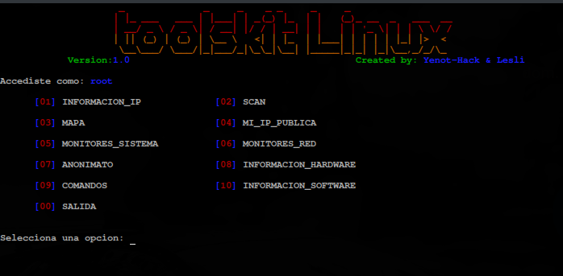

# toolkit-linux
Script bash con multiples herramientas para facilitar el uso de Linux OS, desde comandos, hasta anonimato.
Creado por Yenot-Hack & LesliGrc




## Instalación->

Clonamos el repositorio:
```
$ 𝚐𝚒𝚝 𝚌𝚕𝚘𝚗𝚎 𝚑𝚝𝚝𝚙𝚜://𝚐𝚒𝚝𝚑𝚞𝚋.𝚌𝚘𝚖/𝚈𝚎𝚗𝚘𝚝-𝙷𝚊𝚌𝚔/𝚝𝚘𝚘𝚕𝚔𝚒𝚝-𝚕𝚒𝚗𝚞𝚡.𝚐𝚒𝚝
```

Nos dirigimos a la carpeta creada:
```
$ 𝚌𝚍 𝚝𝚘𝚘𝚕𝚔𝚒𝚝-𝚕𝚒𝚗𝚞𝚡
```

Damos permiso de instalación:
```
$ chmod +x toolkit.sh
```

Ejecutamos:
```
$ ./𝚝𝚘𝚘𝚕𝚔𝚒𝚝.𝚜𝚑
```

###Dpendencias
-`curl`
-`xterm`
-`nmap`
-`monitores de red`
-`monitores de recursos`

>Todos los paquetes necesarios,son instalados automaticamente.
